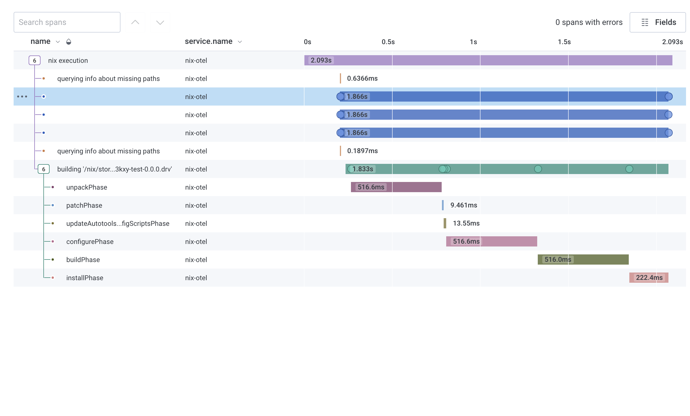

# nix-otel



This program shims the Nix logger with a Nix plugin to extract precise timing
for builds from Nix. It has only been tested against [Honeycomb] with
OTLP/gRPC.

[Honeycomb]: https://honeycomb.io

## Setup

### Honeycomb

Set env vars like so in `.envrc.local`:

```
export OTEL_EXPORTER_OTLP_ENDPOINT=https://api.honeycomb.io
export OTEL_EXPORTER_OTLP_HEADERS=x-honeycomb-team=YOUR_APIKEY
```

Then set the Nix configuration option `plugin-files` to include the plugin .so
or .dylib file.

### Other services

No idea. Sorry. They probably work but might need some minor patches since
[rust-opentelemetry-otlp doesn't support all environment variables
yet](https://github.com/open-telemetry/opentelemetry-rust/issues/774).

## Development

I use nix-direnv and direnv to make this project work across C++ and Rust.

To make rust-analyzer work for you and pick up the right compiler and so on,
you will need to create a wrapper script `direnv-ra` somewhere in your $PATH,
like so:

```bash
#!/bin/sh

direnv exec . rust-analyzer "$@"
```

then set the "rust-analyzer.server.path" variable in your editor settings to
point to it.

### Making the C++ IDE work

This is unnecessarily silly because C++ is bad. Anyway, you can get clangd
working on this project by doing the following:

```
[nix-shell]$ cargo clean -p nix-otel-plugin
[nix-shell]$ bear -- cargo build
```

which will create a `compile_commands.json` with the appropriate contents.

### Running in development

Run in development like so:

```
nix-otel/plugin » cargo b && nix --option plugin-files ../target/debug/libnix_otel_plugin.so build ..#
```


## Project information

Everyone is expected to follow the [code of conduct](./CODE_OF_CONDUCT.md)
while participating in this project.
